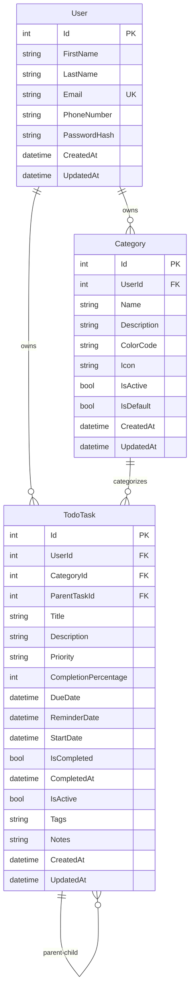

# 🎯 TaskFlow API

**Modern ASP.NET Core 9 Görev Yönetimi REST API'si**

[](https://dotnet.microsoft.com/)
[](https://docs.microsoft.com/en-us/aspnet/core/)
[](https://docs.microsoft.com/en-us/ef/core/)
[](https://sqlite.org/)
[](https://jwt.io/)
[](https://swagger.io/)

---

## 📋 İçindekiler

- [🎯 Proje Hakkında](#-proje-hakkında)
- [✨ Özellikler](#-özellikler)
- [🛠️ Teknolojiler](#️-teknolojiler)
- [🚀 Kurulum](#-kurulum)
- [📖 API Dokümantasyonu](#-api-dokümantasyonu)
- [🧪 Test Etme](#-test-etme)
- [📁 Proje Yapısı](#-proje-yapısı)
- [🗄️ Veritabanı](#️-veritabanı)
- [🔐 Authentication](#-authentication)
- [📊 API Endpoints](#-api-endpoints)
- [🧩 DTOs](#-dtos)
- [⚙️ Konfigürasyon](#️-konfigürasyon)
- [🔧 Geliştirme](#-geliştirme)
- [🚀 Deployment](#-deployment)
- [🤝 Katkıda Bulunma](#-katkıda-bulunma)

---

## 🎯 Proje Hakkında

**TaskFlow API**, modern web uygulamaları için tasarlanmış tam özellikli bir görev yönetimi REST API'sidir. ASP.NET Core 9'un en son özelliklerini kullanarak geliştirilmiş olup, kurumsal seviyede güvenlik, performans ve ölçeklenebilirlik sağlar.

### 🎨 Tasarım Felsefesi

- **🏗️ Clean Architecture** - Katmanlı mimari ve separation of concerns
- **🔒 Security First** - JWT authentication ve data validation
- **📖 API First** - RESTful design principles ve OpenAPI specification
- **🧪 Testable** - Comprehensive test coverage ve mock-friendly design
- **📚 Documentation** - Self-documenting code ve detailed API docs

---

## ✨ Özellikler

### 🔐 **Authentication & Security**
- **JWT Token** tabanlı authentication
- **BCrypt** ile şifrelenmiş password storage
- **Role-based** authorization (gelecekte genişletilebilir)
- **User isolation** - Her kullanıcı sadece kendi verilerine erişir

### 👤 **User Management**
- Kullanıcı kaydı ve girişi
- Profil yönetimi ve güncelleme
- Şifre değiştirme (güvenli)
- Telefon numarası desteği

### 📁 **Category Management**
- Kategoriler oluşturma, düzenleme, silme
- Renk kodları ve icon desteği
- Kullanıcı bazlı kategori isolation
- Soft delete (veri kaybı olmadan)

### ✅ **Advanced Task Management**
- **Hierarchical Tasks** - Ana görev ve alt görevler
- **Priority System** - Low, Normal, High, Critical
- **Completion Tracking** - Progress percentage ve completion dates
- **Due Date Management** - Deadline tracking ve overdue detection
- **Tag System** - Flexible tagging ve kategorileme
- **Rich Notes** - Timestamped notes ve completion comments

### 🔍 **Advanced Search & Filtering**
- **Text Search** - Title ve description'da arama
- **Multi-criteria Filtering** - Category, priority, status, dates
- **Sorting** - Multiple fields ile flexible sorting
- **Pagination** - Performance optimized sayfalama
- **Tag-based Search** - Tag'lere göre filtreleme

### 📊 **Statistics & Dashboard**
- Görev istatistikleri ve özet bilgiler
- Kategori bazlı task dağılımı
- Priority distribution analizi
- Completion rate tracking
- Overdue task detection

### 🛡️ **Data Protection**
- **Soft Delete** - Veri kaybı olmadan silme
- **Audit Trail** - CreatedAt, UpdatedAt tracking
- **Business Rule Validation** - Comprehensive validation rules
- **Circular Reference Protection** - Hierarchical task güvenliği

---

## 🛠️ Teknolojiler

### **Backend Framework**
- **ASP.NET Core 9.0** - Latest .NET framework
- **Entity Framework Core** - Modern ORM
- **SQLite** - Development database (Production için değiştirilebilir)

### **Authentication & Security**
- **JWT (JSON Web Tokens)** - Stateless authentication
- **BCrypt.Net-Next** - Password hashing
- **Microsoft.AspNetCore.Authentication.JwtBearer** - JWT middleware

### **Documentation & Testing**
- **Swagger/OpenAPI** - Interactive API documentation
- **Postman Collection** - Comprehensive test scenarios
- **XML Documentation** - IntelliSense ve auto-generated docs

### **Development Tools**
- **Hot Reload** - Development productivity
- **Detailed Logging** - Microsoft.Extensions.Logging
- **Environment-based Configuration** - appsettings.json hierarchy

---

## 🚀 Kurulum

### **Gereksinimler**
- **.NET 9.0 SDK** - [Download](https://dotnet.microsoft.com/download)
- **Git** - Version control
- **Postman** (opsiyonel) - API testing için

### **1. Projeyi İndir**
```bash
git clone https://github.com/your-username/TaskFlow.git
cd TaskFlow/TaskFlow.API
```

### **2. Dependencies Yükle**
```bash
dotnet restore
```

### **3. Database Oluştur**
```bash
dotnet ef database update
```

### **4. Uygulamayı Çalıştır**
```bash
dotnet run
```

### **5. API'ya Erişim**
- **Swagger UI**: http://localhost:5280/swagger
- **API Base URL**: http://localhost:5280/api
- **Health Check**: http://localhost:5280/swagger (API durumu)

---

## 📖 API Dokümantasyonu

### **Swagger UI** 
Uygulama çalıştıktan sonra: **http://localhost:5280/swagger**

### **API Base URL**
```
http://localhost:5280/api
```

### **Response Format**
Tüm API response'ları standardized format kullanır:

```json
{
  "success": true,
  "message": "İşlem başarıyla tamamlandı",
  "data": { /* Response data */ },
  "errors": null,
  "timestamp": "2024-12-08T10:30:00Z"
}
```

---

## 🧪 Test Etme

### **1. Postman Collection (Önerilen)**
```bash
# Proje root'undaki collection'ı import edin:
TaskFlow-Postman-Collection.json
```

**Collection Features:**
- ✅ **14 test scenario** - Complete workflow coverage
- ✅ **Automatic token management** - JWT token otomatik set edilir
- ✅ **Environment variables** - Dynamic test data
- ✅ **Pre/Post scripts** - Automated testing logic

**Test Sırası:**
1. User Registration → Login (JWT token)
2. Category Creation → CRUD operations
3. Task Creation → Full task management
4. Advanced filtering → Statistics

### **2. Manual cURL Testing**

**Authentication:**
```bash
# Registration
curl -X POST http://localhost:5280/api/users/register \
  -H "Content-Type: application/json" \
  -d '{
    "firstName": "Test",
    "lastName": "User", 
    "email": "test@example.com",
    "password": "TestPass123!",
    "confirmPassword": "TestPass123!",
    "phoneNumber": "+905551234567"
  }'

# Login
curl -X POST http://localhost:5280/api/users/login \
  -H "Content-Type: application/json" \
  -d '{
    "email": "test@example.com",
    "password": "TestPass123!"
  }'
```

**Task Operations (JWT token gerekli):**
```bash
# Get all tasks
curl -X GET http://localhost:5280/api/todotasks \
  -H "Authorization: Bearer YOUR_JWT_TOKEN"

# Create task  
curl -X POST http://localhost:5280/api/todotasks \
  -H "Authorization: Bearer YOUR_JWT_TOKEN" \
  -H "Content-Type: application/json" \
  -d '{
    "categoryId": 1,
    "title": "Test Task",
    "description": "Task description",
    "priority": "High"
  }'
```

---

## 📁 Proje Yapısı

```
TaskFlow.API/
├── 📂 Controllers/           # API Controllers
│   ├── 👤 UsersController.cs         # User management
│   ├── 📁 CategoriesController.cs    # Category CRUD
│   └── ✅ TodoTasksController.cs     # Task management (ana controller)
│
├── 📂 DTOs/                  # Data Transfer Objects
│   ├── 👤 UserDto.cs                # User-related DTOs
│   ├── 📁 CategoryDto.cs            # Category DTOs  
│   ├── ✅ TodoTaskDto.cs            # Task DTOs (comprehensive)
│   └── 📋 ApiResponseModel.cs       # Standardized responses
│
├── 📂 Models/                # Entity Models
│   ├── 👤 User.cs                   # User entity
│   ├── 📁 Category.cs               # Category entity
│   ├── ✅ TodoTask.cs               # Task entity (main)
│   └── 🔧 Priority.cs               # Priority enum
│
├── 📂 Data/                  # Database Context
│   └── 🗄️ TaskFlowDbContext.cs     # EF Core DbContext
│
├── 📂 Services/              # Business Logic
│   ├── 🔐 IJwtService.cs           # JWT interface
│   └── 🔐 JwtService.cs            # JWT implementation
│
├── 📂 Migrations/            # EF Core Migrations
│   ├── 🏗️ InitialCreate.cs         # Initial database schema
│   └── 📞 AddPhoneNumberToUser.cs  # Phone number addition
│
├── 📂 Properties/            # Project Configuration
│   └── ⚙️ launchSettings.json      # Development settings
│
├── 📄 Program.cs             # Application entry point
├── 📄 TaskFlow.API.csproj    # Project configuration
├── 📄 appsettings.json       # Application settings
├── 📄 appsettings.Development.json  # Development settings
└── 📖 README.md              # This documentation
```

---

## 🗄️ Veritabanı

### **Entity Relationship Diagram**



### **Database Features**
- **🔗 Relationships** - Foreign key constraints ve navigation properties
- **🗂️ Indexing** - Performance optimization için strategic indexes
- **🛡️ Data Integrity** - Required fields ve business rule validation
- **📅 Audit Trail** - Automatic timestamp tracking
- **🔄 Soft Delete** - IsActive flag ile veri koruma

---

## 🔐 Authentication

### **JWT Token System**

**Configuration (appsettings.json):**
```json
{
  "Jwt": {
    "SecretKey": "your-super-secret-key-minimum-32-characters",
    "Issuer": "TaskFlowAPI",
    "Audience": "TaskFlowClients", 
    "ExpirationInHours": 24
  }
}
```

**Token Structure:**
```json
{
  "sub": "123",           # User ID
  "email": "user@mail.com", 
  "firstName": "John",
  "lastName": "Doe",
  "exp": 1623456789,      # Expiration
  "iat": 1623370389       # Issued at
}
```

**Authentication Flow:**
1. **Register/Login** → Server generates JWT
2. **Client stores token** → LocalStorage/Memory
3. **API requests** → `Authorization: Bearer <token>`
4. **Server validates** → JWT middleware verification

### **Protected Endpoints**
Tüm `/api/todotasks` ve `/api/categories` endpoints JWT gerektirir.

---

## 📊 API Endpoints

### **🔐 Authentication**
| Method | Endpoint | Description | Auth |
|--------|----------|-------------|------|
| `POST` | `/api/users/register` | Kullanıcı kaydı | ❌ |
| `POST` | `/api/users/login` | Kullanıcı girişi | ❌ |
| `GET` | `/api/users/profile` | Profil bilgileri | ✅ |
| `PUT` | `/api/users/profile` | Profil güncelleme | ✅ |
| `GET` | `/api/users/{id}` | Public profil | ❌ |

### **📁 Categories**
| Method | Endpoint | Description | Auth |
|--------|----------|-------------|------|
| `GET` | `/api/categories` | Kategorileri listele | ✅ |
| `GET` | `/api/categories/{id}` | Kategori detayı | ✅ |
| `POST` | `/api/categories` | Kategori oluştur | ✅ |
| `PUT` | `/api/categories/{id}` | Kategori güncelle | ✅ |
| `DELETE` | `/api/categories/{id}` | Kategori sil | ✅ |

### **✅ TodoTasks (Ana Fonksiyonellik)**
| Method | Endpoint | Description | Auth |
|--------|----------|-------------|------|
| `GET` | `/api/todotasks` | Task listesi (filtering + pagination) | ✅ |
| `GET` | `/api/todotasks/{id}` | Task detayı | ✅ |
| `POST` | `/api/todotasks` | Task oluştur | ✅ |
| `PUT` | `/api/todotasks/{id}` | Task güncelle | ✅ |
| `DELETE` | `/api/todotasks/{id}` | Task sil (soft delete) | ✅ |
| `PATCH` | `/api/todotasks/{id}/complete` | Task tamamla/geri al | ✅ |
| `GET` | `/api/todotasks/statistics` | Task istatistikleri | ✅ |

### **🔍 Advanced Query Parameters**

**Task Filtering (`GET /api/todotasks`):**
```
?categoryId=1              # Kategoriye göre filtrele
&parentTaskId=5            # Alt task'ları getir
&isCompleted=false         # Tamamlanma durumu
&priority=High             # Öncelik seviyesi
&searchText=API            # Metin arama
&tag=urgent                # Tag'e göre arama
&dueDateFrom=2024-01-01    # Tarih aralığı başlangıç
&dueDateTo=2024-12-31      # Tarih aralığı bitiş
&isOverdue=true            # Süresi geçmiş task'lar
&sortBy=CreatedAt          # Sıralama alanı
&sortAscending=false       # Sıralama yönü
&page=1                    # Sayfa numarası
&pageSize=20               # Sayfa boyutu
&includeSubTasks=true      # Alt task'ları dahil et
&onlyParentTasks=true      # Sadece ana task'lar
```

---

## 🧩 DTOs

### **User DTOs**
- **`UserDto`** - Public user information
- **`RegisterDto`** - User registration data
- **`LoginDto`** - Login credentials
- **`AuthResponseDto`** - Authentication response with JWT
- **`UpdateProfileDto`** - Profile update data
- **`ChangePasswordDto`** - Password change data

### **Category DTOs**  
- **`CategoryDto`** - Category information
- **`CreateCategoryDto`** - Category creation data
- **`UpdateCategoryDto`** - Category update data

### **TodoTask DTOs (Comprehensive)**
- **`TodoTaskDto`** - Full task information with computed properties
- **`CreateTodoTaskDto`** - Task creation with validation
- **`UpdateTodoTaskDto`** - Partial task update
- **`TodoTaskFilterDto`** - Advanced filtering parameters
- **`CompleteTaskDto`** - Task completion data

### **Response DTOs**
- **`ApiResponseModel<T>`** - Standardized API responses
- **`PaginationDto`** - Pagination metadata
- **`StatisticsDto`** - Dashboard statistics

---

## ⚙️ Konfigürasyon

### **appsettings.json**
```json
{
  "ConnectionStrings": {
    "DefaultConnection": "Data Source=TaskFlow.db"
  },
  "Jwt": {
    "SecretKey": "your-super-secret-key-minimum-32-characters-long",
    "Issuer": "TaskFlowAPI",
    "Audience": "TaskFlowClients",
    "ExpirationInHours": 24
  },
  "Logging": {
    "LogLevel": {
      "Default": "Information",
      "Microsoft.AspNetCore": "Warning",
      "Microsoft.EntityFrameworkCore": "Information"
    }
  }
}
```

### **Environment Variables**
Production'da sensitive data için environment variables kullanın:

```bash
export JWT_SECRET_KEY="your-production-secret-key"
export CONNECTION_STRING="your-production-db-connection"
```

---

## 🔧 Geliştirme

### **Development Commands**
```bash
# Build project
dotnet build

# Run with hot reload
dotnet run

# Run tests (future)
dotnet test

# Clean build artifacts
dotnet clean

# Add new migration
dotnet ef migrations add MigrationName

# Update database
dotnet ef database update

# Generate EF migration script
dotnet ef migrations script
```

### **Code Quality**
- **📏 Consistent Naming** - C# naming conventions
- **📝 XML Documentation** - All public APIs documented
- **🧪 Input Validation** - Comprehensive DTO validation
- **🛡️ Error Handling** - Global exception handling
- **📊 Logging** - Structured logging throughout

### **Best Practices**
- **🏗️ Separation of Concerns** - Clear layer separation
- **🔒 Security First** - Input validation ve authorization
- **⚡ Performance** - Async/await ve efficient queries
- **📖 Documentation** - Self-documenting code

---

## 🚀 Deployment

### **Production Readiness Checklist**
- ✅ **Environment Configuration** - Production appsettings
- ✅ **Database Migration** - SQL Server/PostgreSQL setup
- ✅ **SSL/HTTPS** - Certificate configuration
- ✅ **Logging** - Centralized logging (Serilog/NLog)
- ✅ **Monitoring** - Health checks ve metrics
- ✅ **Security** - Rate limiting ve CORS

### **Docker Support (Future)**
```dockerfile
FROM mcr.microsoft.com/dotnet/aspnet:9.0 AS base
WORKDIR /app
EXPOSE 80

FROM mcr.microsoft.com/dotnet/sdk:9.0 AS build
WORKDIR /src
COPY ["TaskFlow.API.csproj", "."]
RUN dotnet restore
COPY . .
RUN dotnet build -c Release -o /app/build

FROM build AS publish
RUN dotnet publish -c Release -o /app/publish

FROM base AS final
WORKDIR /app
COPY --from=publish /app/publish .
ENTRYPOINT ["dotnet", "TaskFlow.API.dll"]
```

---

## 🤝 Katkıda Bulunma

### **Development Setup**
1. Fork the repository
2. Create feature branch (`git checkout -b feature/new-feature`)
3. Commit changes (`git commit -am 'Add new feature'`)
4. Push to branch (`git push origin feature/new-feature`)
5. Create Pull Request

### **Coding Standards**
- Follow C# coding conventions
- Add XML documentation for public APIs
- Include unit tests for new features
- Update README for significant changes

### **Issue Reporting**
- Use GitHub Issues for bug reports
- Include reproduction steps
- Provide environment details

---

## 📄 License

This project is licensed under the MIT License - see the [LICENSE](LICENSE) file for details.

---

## 👨‍💻 Geliştirici

**TaskFlow API** - Modern görev yönetimi için geliştirilmiş professional-grade REST API.

---

*⭐ Bu projeyi beğendiyseniz GitHub'da star vermeyi unutmayın!*

---

## 📞 İletişim & Destek

- **GitHub Issues**: Bug reports ve feature requests
- **Documentation**: Bu README dosyası
- **API Docs**: http://localhost:5280/swagger (development)

**Happy Coding! 🚀** 